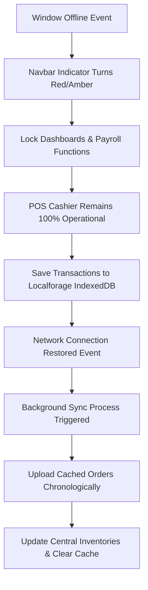

# POS CAOCAO: MASTER DESIGN SPECIFICATION
## Comprehensive UI/UX, Responsive Viewports, State Management, and Architecture Design

Dokumen ini merupakan panduan spesifikasi desain terpadu (Master Design Specification) untuk aplikasi **POS CAOCAO** (Premium Cafe Workspace Ecosystem). POS CAOCAO adalah sistem Point of Sale (POS) multi-tenant premium yang dirancang khusus untuk Food & Beverage (F&B) dengan optimasi tiga jenis *viewport*, sistem otomatisasi resep (BOM), Kitchen & Bar Display Systems (KDS) real-time, manajemen absensi geofencing GPS, pembukuan keuangan (PnL), payroll karyawan, serta ketahanan operasional offline penuh.

---

## DAFTAR ISI SISTEM DAN HALAMAN
1. [Prinsip Desain Global & Token Estetika](#prinsip-desain-global--token-estetika)
2. [Halaman 1: Landing Page & Registrasi Tenant](#halaman-1-landing-page--registrasi-tenant)
3. [Halaman 2: Login & Sinkronisasi HP Staf](#halaman-2-login--sinkronisasi-hp-staf)
4. [Halaman 3: Core Dashboard layout Shell](#halaman-3-core-dashboard-layout-shell)
5. [Halaman 4: Owner Business Intelligence & Analytics](#halaman-4-owner-business-intelligence--analytics)
6. [Halaman 5: Staff Attendance & Geofencing Portal](#halaman-5-staff-attendance--geofencing-portal)
7. [Halaman 6: KDS Bar Display System (Antrian Barista)](#halaman-6-kds-bar-display-system-antrian-barista)
8. [Halaman 7: Advanced POS & Cashier Checkout](#halaman-7-advanced-pos--cashier-checkout)
9. [Halaman 8: Shift, Attendance & Payroll System](#halaman-8-shift-attendance--payroll-system)
10. [Halaman 9: Inventory & Ingredients BOM (Pergudangan)](#halaman-9-inventory--ingredients-bom-pergudangan)
11. [Halaman 10: KDS Kitchen Display System (Antrian Masak)](#halaman-10-kds-kitchen-display-system-antrian-masak)
12. [Halaman 11: Settings & Cafe Configurations](#halaman-11-settings--cafe-configurations)
13. [Halaman 12: Mobile Order-Taking Waiter Portal](#halaman-12-mobile-order-taking-waiter-portal)
14. [Arsitektur Keandalan Offline (Partial Offline Mode)](#arsitektur-keandalan-offline-partial-offline-mode)

---

## PRINSIP DESAIN GLOBAL & TOKEN ESTETIKA
Untuk menghadirkan pengalaman visual premium yang selaras dengan kafe kelas atas, POS CAOCAO menerapkan prinsip estetika modern netral hangat dengan panduan gaya berikut:
*   **Warm Neutral Palette**: Dominasi warna cokelat espresso pekat (`bg-cafe-900`), abu-abu cafe lembut (`bg-cafe-50`), teks arang hitam solid (`text-cafe-900`), aksen hijau zaitun pekat (`text-earth-olive` / `bg-earth-olive`), dan latar belakang putih bersih (`bg-white`).
*   **No Gold Gradients**: Menghindari penggunaan gradasi emas atau warna emas imitasi agar tampilan tetap elegan, kontemporer, dan bersahaja.
*   **Elevated Components**: Penerapan sudut membulat lebar (`rounded-3xl` / `rounded-2xl`), bayangan melayang yang lembut (`shadow-premium` / `shadow-sm`), batas transparan ultra-tipis (`border-cafe-200/50`), dan lapisan buram blur di latar belakang (`backdrop-blur-sm`).
*   **Micro-Animations**: Transisi skala dinamis (`active:scale-95 transition-all`), efek transisi sorot warna (`hover:bg-cafe-800 hover:text-white`), efek denyut (`animate-pulse`), dan visual pemuatan khusus.
*   **Touch Targets**: Jaminan tap-target minimal **48x48 piksel** (dioptimalkan ke **52px** atau lebih pada seluler/tablet) untuk kenyamanan penuh jari waiter dan barista saat bekerja cepat.

---

## HALAMAN 1: LANDING PAGE & REGISTRASI TENANT
*   **Path Kode**: `apps/web/src/app/page.tsx`
*   **Fungsi Utama**: Pintu gerbang utama pemasaran produk dan form registrasi mandiri untuk membuat profil cafe baru (Multi-Tenant) secara instan.

### Visual & Estetika (Aesthetics)
- Latar belakang abu-abu cafe lembut (`bg-cafe-50`) dihiasi lingkaran blur abstrak bernada hangat (`bg-cafe-200/40 blur-[120px]` dan `bg-earth-olive/10 blur-[150px]`) di sudut diagonal layar untuk menciptakan dimensi visual yang premium.
- Lencana "Multi-Tenant" dinamis dengan animasi denyut (`animate-pulse`) sebagai fokus utama teknologi cloud.
- Penataan logo kafe berupa ikon `Coffee` yang dibungkus kotak coklat gelap premium (`bg-cafe-800 rounded-xl`).

### Optimasi Viewport (Responsivitas)
- **Desktop (Layar Lebar)**: Tata letak *grid split* 12 kolom (`lg:grid-cols-12`). Kolom kiri (7 kolom) menayangkan brand, deskripsi proposisi nilai, dan 2-kolom ringkasan keunggulan sistem. Kolom kanan (5 kolom) menyajikan form pendaftaran mandiri di dalam kartu putih melayang (`rounded-3xl p-8 border border-cafe-100 shadow-premium`).
- **Tablet & Mobile (Layar Kecil)**: Elemen kiri dan kanan melebur secara linier ke bawah. Konten edukasi bertumpuk di atas form registrasi agar area ketuk input tetap luas dan mudah dijangkau satu tangan.

### Komponen UI/UX Utama
- **Automatic BOM Deductions Card**: Widget edukasi dengan ikon petir hijau untuk menyorot pengurangan stok bahan baku otomatis.
- **Reliable Offline Mode Card**: Widget dengan ikon perisai centang penanda ketahanan offline.
- **Form Registrasi Mandiri**: Bidang input tinggi (`py-3`) untuk Nama Cafe, Alamat, No HP, Nama Owner, Email, dan Password.
- **Layar Sukses (isSuccess)**: Panel visual perayaan centang bulat besar (`Check`) sebelum dialihkan ke dasbor.

### Manajemen State & Alur Data
- `formData` (object): Penampung input bidang registrasi.
- `isLoading` (boolean): Menampilkan indikator loading tombol submit.
- `isSuccess` (boolean): Menampilkan panel sukses pendaftaran.
- `errorMessage` (string): Banner galat jika email duplikat atau input tidak lengkap.
- **API Target**: POST `http://localhost:4001/register` yang menghasilkan pembuatan Tenant dan penetapan peran Owner.
- **Offline Bypass Fallback**: Jika server API mati selama pengetesan, sistem secara cerdas menyuntikkan profil dummy Owner kafe ke `localStorage` (menyimpan `pos_token`, `pos_user`, `pos_tenant_id`) lalu mengalihkan pengguna ke halaman kasir dalam 1,5 detik guna menjamin kelancaran simulasi.

---

## HALAMAN 2: LOGIN & SINKRONISASI HP STAF
*   **Path Kode**: `apps/web/src/app/login/page.tsx`
*   **Fungsi Utama**: Portal masuk multifungsi yang memisahkan akses email/sandi pengelola (Owner & Admin) dengan sistem sinkronisasi unik smartphone pribadi karyawan (Staff Roster).

### Visual & Estetika (Aesthetics)
- Latar belakang abu-abu semen premium (`bg-cafe-100`) dengan kartu konten melayang putih bersih beraksen batas tipis transparan.
- Tab geser interaktif coklat espresso gelap (`bg-cafe-850`) dengan efek skala responsif.
- Panel numpad numerik 3x4 berwarna pastel hangat (`bg-cafe-50`) untuk input PIN karyawan.

### Optimasi Viewport (Responsivitas)
- **Desain Mobile-First**: Dioptimalkan khusus agar pas di layar smartphone staf terkecil.
- Tombol-tombol input numerik keypad didesain lebar dengan tinggi tap 56px (`h-14`) untuk kenyamanan jari yang cepat dan presisi.

### Komponen UI/UX Utama
- **Peralihan Portal Tab**: Toggle "Owner/Admin" vs "HP Staf Roster".
- **Form Sinkronisasi HP Staf**: Form input Nama Perangkat HP dan Token Sinkronisasi Outlet.
- **Dasbor Mandiri Staf (Kondisi Terhubung)**: Widget status "Outlet Terhubung", rincian perangkat, tombol kamera pemindai QR absensi, dan tombol putus koneksi outlet (`Trash2`).
- **Numpad PIN Keypad (Roster PIN)**: Tampilan visual titik sandi melingkar (`• • • •`) diikuti tombol keypad interaktif.
- **Modul Pemindai Kamera (`QrCameraScanner`)**: Overlay hitam buram melayang dengan area bidik kamera khusus untuk memindai QR dinamis tablet kasir.

### Manajemen State & Alur Data
- `activePortal` ('OWNER' | 'STAFF'): Mengontrol panel portal aktif.
- `isDeviceConnected` (boolean): Status kelayakan HP staf terdaftar di outlet.
- `showPinPad` (boolean): Mengontrol penayangan numpad input PIN absen.
- `pin` (string): Penampung input digit PIN staf.
- `employees` (array): Memuat data roster karyawan dari cache local.
- **Logika Scan QR & Validasi Absen**:
  1. Staf memindai QR dinamis dari layar kasir. Token QR harus berformat `QR-ATT-[code]-[timestamp]`.
  2. Sistem menghitung selisih waktu (`Date.now() - timestamp`). Jika >60 detik, scan dibatalkan karena kedaluwarsa.
  3. Perangkat divalidasi silang terhadap daftar resmi terdaftar di `pos_registered_devices`. Jika dibatalkan admin, akses terputus.
  4. Staf memasukkan PIN roster pribadi. Jika terverifikasi, status clock-in/out dicatat di `pos_attendances` lengkap dengan lokasi HP perangkat.

---

## HALAMAN 3: CORE DASHBOARD LAYOUT SHELL
*   **Path Kode**: `apps/web/src/app/dashboard/layout.tsx` & `page.tsx`
*   **Fungsi Utama**: Cangkang layout responsif dasbor utama, pusat otentikasi hak akses berbasis peran (RBAC Sub-system), simulator bypass peran Owner, serta monitor koneksi offline.

### Visual & Estetika (Aesthetics)
- Sidebar kiri gelap premium arang (`bg-cafe-900`) untuk kontras fokus menu yang solid, berpadu dengan area konten utama abu-abu cafe lembut (`bg-cafe-50`).
- Badge status jaringan cloud dinamis (`Cloud` / `CloudOff`) berwarna hijau zaitun (Online) atau amber (Offline).
- Panel Simulator melayang berwarna espresso arang berukuran kompak dengan ikon `RefreshCw` berputar lambat (`animate-spin-slow`).

### Optimasi Viewport (Responsivitas)
- **Desktop (Layar Lebar)**: Sidebar kiri kokoh berukuran lebar `w-64` yang dapat disusutkan menjadi `w-20` (`isSidebarExpanded`) menggunakan tombol panah dinamis.
- **Tablet / Mobile**: Sidebar kiri disembunyikan. Mengetuk tombol hamburger (`Menu`) di kasir akan memunculkan menu sliding samping (`animate-slide-right`) dari kiri dengan latar overlay blur buram (`bg-cafe-950/60 backdrop-blur-sm`).

### Komponen UI/UX Utama
- **Collapsible Sidebar**: Rangkaian tombol navigasi berikon Lucide yang hanya menampilkan menu sesuai peran aktif pengguna (RBAC strict).
- **Navbar Operasional**: Tombol hamburger responsif, salam personal staf, indikator status sinkronisasi, dan Terminal ID unik kafe.
- **Offline Connection Banner**: Banner peringatan amber beranimasi pantul (`animate-bounce`) jika kasir kehilangan koneksi internet.
- **Simulator Peran Melayang (Owner Simulator)**: Kotak kendali melayang khusus akun Owner untuk menguji peran OWNER, ADMIN, CASHIER, BARISTA, dan KITCHEN secara instan.
- **PIN Verification Modal (RBAC Gate)**: Keypad 3x4 numerik virtual berukuran besar untuk memverifikasi PIN sebelum berpindah peran demi aspek keamanan.

### Manajemen State & Alur Data
- `user` (object): Menyimpan data user aktif (Nama, Peran, Nama Cafe).
- `isOnline` (boolean): Menyimpan status koneksi internet klien.
- `pendingSyncCount` (number): Menyimpan antrean pesanan offline yang belum terunggah.
- `isPinModalOpen` (boolean) & `pendingRole` (string): Mengontrol alur modal sandi pemindahan peran.
- **RBAC Strict Routing**: Owner diarahkan ke `/dashboard/analytics`, Admin & Kasir ke `/dashboard/cashier`, Barista ke `/dashboard/bar`, dan Koki ke `/dashboard/kitchen` melalui manipulasi rute Next.js Router (`router.replace`).

---

## HALAMAN 4: OWNER BUSINESS BI & ANALYTICS
*   **Path Kode**: `apps/web/src/app/dashboard/analytics/page.tsx`
*   **Fungsi Utama**: Pusat kendali laporan finansial laba rugi komprehensif, BEP rasio, saran profitabilitas menu (BI), dan pemeringkatan performa presensi roster staf.

### Visual & Estetika (Aesthetics)
- Lencana profitabilitas menu berwarna-warni (`EXCELLENT` hijau segar, `HEALTHY` olive, `CRITICAL` merah) berpadu dengan kotak anjuran taktis pemasaran.
- Bagan batang bulanan CSS murni (Omset Kotor vs Laba Bersih) dengan visual dinamis sorot transisi tinggi (`group-hover:bg-earth-olive`).
- Ringkasan KPI berbayang solid premium dan berbatas garis tipis transparan.

### Optimasi Viewport (Responsivitas)
- **Desktop Grid Layout**:
  - Kolom statistik ringkasan finansial sejajar 4 kolom (`grid-cols-4`).
  - Laporan Ledger PnL (2 kolom) dan Rasio BEP (1 kolom) tersusun rapi berdampingan.
  - Kartu rekomendasi profitabilitas menu tertata rapi dalam 4 kolom grid.
- **Tablet / Mobile Viewport**: Seluruh baris grid menyusut menjadi baris tunggal vertikal. Tabel laporan PnL dan kehadiran diubah menjadi gulir horizontal (`overflow-x-auto`) dengan tinggi tap baris minimal 48px.

### Komponen UI/UX Utama
- **Kartu Ringkasan Finansial (KPI Cards)**: Menampilkan metrik Gross Revenue, HPP BOM Ratio, Labor Cost, dan Waste Loss.
- **Buku Ledger Laba Rugi Komprehensif (PnL Ledger)**: Tabel detail arus pendapatan kafe dikurangi pengeluaran operasional (sewa, listrik, upah, bahan terbuang).
- **Rasio Kesehatan Bisnis & BEP**: Bar indikator visual yang memetakan Food HPP Ratio, Labor Ratio, dan Waste Ratio terhadap standar industri F&B sehat.
- **BI Decision Engine**: Analisis profitabilitas otomatis per cangkir menu dengan rekomendasi diskon taktis atau penyesuaian harga jual.
- **Tabel Disiplin & Presensi Staf**: Tabel pemeringkatan kinerja karyawan berdasarkan frekuensi terlambat, denda potong gaji, dan validitas GPS Geofencing.

### Manajemen State & Alur Data
- `grossRevenue`, `wasteLoss`, `opnameLoss`, `hppValue`: Variabel state keuangan terhitung otomatis.
- `employees` & `attendances`: Roster staf dan data absensi digital untuk kalkulasi labor cost.
- `hrPolicy` (object): Kebijakan durasi toleransi telat dan tarif premi lembur.
- **Live Sync Data**: Memasang pendengar event `storage` untuk langsung memperbarui visual laporan finansial jika kasir baru saja menyelesaikan pesanan offline/online di tab POS Kasir.
- **Export CSV Utility**: Tombol ekspor laporan keuangan dan performa staf ke format berkas Excel/CSV (`handleExportCSV`).

---

## HALAMAN 5: STAFF ATTENDANCE & GEOFENCING PORTAL
*   **Path Kode**: `apps/web/src/app/dashboard/attendance/page.tsx`
*   **Fungsi Utama**: Stasiun pencatatan presensi mandiri karyawan terintegrasi geofencing GPS menggunakan QR Code Dinamis ataupun Keypad PIN cadangan.

### Visual & Estetika (Aesthetics)
- **Circular Timer Ring**: Animasi cincin hitung mundur visual melingkar murni menggunakan SVG (`strokeDasharray` & `strokeDashoffset`) yang berubah warna dari hijau subur ke merah menyala saat durasi token dinamis mendekati detik-detik terakhir kedaluwarsa.
- Kartu QR Code melayang dengan batas sudut membulat elegan (`rounded-2xl shadow-md`).
- Area numpad virtual berwarna pastel abu-abu netral dengan kontras tombol tinggi.

### Optimasi Viewport (Responsivitas)
- **Tablet Layout (Cashier Screen)**: Layout 3 kolom:
  - **Kiri (1 Kolom)**: Stasiun generator QR Code dinamis dan keypad PIN cadangan.
  - **Kanan (2 Kolom)**: Roster absensi staf operasional dan tombol aksi cetak QR Code karyawan.
- **Mobile Viewport**: Seluruh kolom menyusut menjadi baris vertikal teratur yang meletakkan panel scan QR di bagian teratas layar.

### Komponen UI/UX Utama
- **QR Code Absensi Dinamis (Tablet Screen)**: Panel penampil QR Code presensi dinamis berdurasi validitas 60 detik lengkap dengan tombol generator token dan penayangan kode cadangan alfanumerik (`attendanceCode`).
- **Keypad Backup PIN**: Papan tombol 3x4 numerik virtual.
- **GPS Geofencing Simulator Panel**: Switcher simulasi koordinat GPS satelit perangkat staf ("Di Cafe" Lat -6.2088 radius 5m vs "Di Luar Area" Lat -6.2300 radius 4.8km).
- **Roster & QR Karyawan**: Tabel berisi nama, jabatan, PIN roster, dan tombol aksi unduh kartu QR pribadi karyawan.

### Manajemen State & Alur Data
- `activeAttendanceToken` (string): Token QR terenkripsi yang memuat kode acak dan *timestamp* waktu pembuatan.
- `timeLeft` (number): Countdown sisa waktu validitas token (detik).
- `clockPin` (string): Menampung digit PIN yang diinput via numpad.
- `gpsMode` ('CAFE' | 'AWAY'): Menyetel simulasi radius GPS absencing.
- `isQrModalOpen` (boolean) & `activeQrEmployee` (object): Mengontrol alur modal unduh QR staf.
- **Logika Roster & GPS Geofence**:
  * Standar jam masuk adalah pukul 08:00 pagi. Jika staf melakukan clock-in lewat dari menit toleransi (default 15 menit), status disetel menjadi **Terlambat** dan denda potong gaji diaktifkan.
  * Jika GPS mendeteksi staf berada di luar koordinat aman kafe saat mengetuk tombol absen, status disetel menjadi **Diluar Area (Tidak Valid)**, jam kerja bernilai **0**, dan denda denda kedisiplinan diaktifkan.

---

## HALAMAN 6: KDS BAR DISPLAY SYSTEM (ANTRIAN BARISTA)
*   **Path Kode**: `apps/web/src/app/dashboard/bar/page.tsx`
*   **Fungsi Utama**: Stasiun antrian digital bar KDS berbasis Kanban yang merutekan secara khusus setiap menu pesanan berkategori **Minuman (Drink)** secara real-time langsung ke barista.

### Visual & Estetika (Aesthetics)
- Latar belakang abu-abu cafe premium (`bg-cafe-50`), tajuk KDS bar cokelat espresso (`bg-cafe-800`), aksen hijau olive (`text-earth-olive`), serta kartu antrean putih bersih.
- **Indikator Waktu Dinamis**: Batas kartu KDS otomatis berubah menjadi kuning keemasan (`border-amber-500`) jika pesanan tertahan di barista >10 menit guna mengoptimalkan kecepatan penyajian.

### Optimasi Viewport (Responsivitas)
- **Desain Tablet Split Grid**: Dirancang khusus untuk monitor KDS tablet yang terpasang di atas bar counter. Tata letak grid dinamis otomatis menyesuaikan diri:
  - 1 kolom pada layar HP barista.
  - 2 kolom pada monitor kecil.
  - 3-4 kolom pada monitor lebar resolusi tinggi (`lg:grid-cols-3 xl:grid-cols-4`).
- **Target Sentuh Nyaman (Minimum 48px)**: Setiap item minuman dirancang tebal (minimal 52px) agar barista dapat mengetuk status selesai racik menggunakan satu jari dengan mudah dan higienis.

### Komponen UI/UX Utama
- **Header KDS Bar**: Memuat judul panel, ikon cangkir kopi (`Coffee`), pencatat statistik tiket minuman aktif, dan label status.
- **Kanban Order Ticket (Tiket Racik Bar)**: Setiap kartu memuat:
  - Judul Meja (misal: "Bar Counter 1") dengan warna latar belakang kontras tinggi.
  - Nama Waiter penginput pesanan.
  - Elapsed Timer (penunjuk menit waktu tunggu sejak pesanan diproses di kasir).
  - Daftar Item minuman berserta catatan khusus (misal: "Warm (Oat milk switch)", "Double Shot").
  - Tombol aksi centang penyelesaian item individu.
  - Tombol utama "Selesaikan Minuman" untuk menyelesaikan seluruh tiket.
- **Layar Antrian Kosong**: Ilustrasi ikon Coffee abu-abu berbayang premium jika seluruh antrean racik minuman telah disajikan.

### Manajemen State & Alur Data
- `tickets` (array): Array objek tiket pesanan minuman aktif.
- `now` (date): Objek waktu real-time yang memicu pembaruan timer elapsed menit per detik.
- `confirmTicketId` (string | null): Menyimpan ID tiket yang sedang dikonfirmasi untuk diselesaikan.
- **Metode Aksi KDS**:
  - `toggleItemCompleted`: Menandai item minuman individu dalam satu tiket sudah selesai diracik (memberikan gaya coretan teks / *line-through* abu-abu halus).
  - `triggerCompleteConfirmation`: Menampilkan dialog popup verifikasi ganda sebelum mengarsipkan tiket minuman.
  - `handleExecuteCompleteTicket`: Mengirim status PATCH `READY` ke API KDS (`http://localhost:4002/kds/tickets/${ticketId}`) untuk mengarsipkan pesanan dan memberi tahu server kasir.

---

## HALAMAN 7: ADVANCED POS & CASHIER CHECKOUT
*   **Path Kode**: `apps/web/src/app/dashboard/cashier/page.tsx`
*   **Fungsi Utama**: Terminal kasir utama penjualan harian kafe (Point of Sale) yang mengintegrasikan pemetaan denah meja pelanggan, katalog menu dinamis, pengelolaan keranjang pesanan, perhitungan pajak/diskon, pencetakan resi struk belanja fisik, serta keandalan transaksi luring (Offline Mode).

### Visual & Estetika (Aesthetics)
- Latar belakang abu-abu cafe premium (`bg-cafe-50`), kartu produk putih bersih, tombol bayar hijau zaitun pekat (`bg-earth-olive`), teks arang hitam solid (`text-cafe-900`), dan struk belanja bertema monokrom monospaced retro (`font-mono`).
- **Sentuhan Interaktif**:
  - Efek bayangan premium melayang (`hover:shadow-premium`) dan pergeseran skala (`hover:scale-[1.03]`) saat kartu produk disorot.
  - Skema warna status meja dinamis (Abu-abu untuk Kosong, Hijau Zaitun untuk Terisi, Amber untuk Cetak Tagihan).
  - Floating shopping cart button dengan animasi memantul cerdas (`animate-bounce`) saat keranjang terisi.

### Optimasi Viewport (Responsivitas)
- **Tablet / Desktop view (Split Screen Layout)**: Area katalog produk diposisikan memenuhi lebar grid sebelah kiri, sementara panel ringkasan keranjang diletakkan di sisi kanan secara kokoh agar kasir dapat bekerja cepat menekan tombol produk di satu sisi dan meninjau pesanan di sisi lainnya.
- **Mobile Smartphone**: Tata letak diatur dalam format satu kolom linier. Keranjang pesanan diposisikan di dalam panel melayang geser (*sliding drawer modal*) yang dipicu oleh tombol keranjang melayang bawah untuk efisiensi ruang pandang.

### Komponen UI/UX Utama
- **Denah Meja Cafe Aktif (Table Layout Grid)**: Grid pemetaan visual meja pelanggan terintegrasi dengan status meja operasional (`AVAILABLE`, `OCCUPIED`, `BILL_PRINTED`).
- **Katalog Menu & Pencarian**: Tab pemisah kategori (Semua Menu, Makanan, Minuman, Add-on) dan kolom pencarian menu responsif.
- **Kartu Produk Premium**: Menampilkan nama produk, harga rupiah, tombol penambah item, serta badge penanda resep BOM (*BOM Recipe*) jika produk tersebut menggunakan sistem pengurangan stok otomatis.
- **Panel Keranjang Belanja & Checkout Drawer**:
  - Kolom penginputan catatan kustom per item (misal: "less sugar", "no ice").
  - Dropdown daftar voucher diskon aktif (persentase/nominal) terintegrasi sistem.
  - Penghitung agregasi biaya (Subtotal, Potongan Diskon, Pajak PPN 11%, Service Charge 5%, dan Total Net Bayar).
  - Pilihan metode bayar (`CASH`, `QRIS`, `DEBIT`).
- **Retro Thermal Receipt Printer (Struk Belanja)**: Desain struk semantik monospaced ala thermal printer 58mm/80mm yang dioptimalkan untuk cetak langsung lewat fungsi cetak asli browser (`window.print()`).

### Manajemen State & Keandalan Offline Mode & Sinkronisasi Cache
- **Offline Reliability**: Sistem memantau status jaringan kasir. Jika koneksi terputus (`isOffline: true`), transaksi checkout tetap diizinkan 100% berjalan normal. Data pesanan disimpan sementara ke laci IndexedDB perangkat via Localforage (`offline_orders`) dengan tanda antrean tertunda.
- **Sync Integration**: Begitu internet kembali pulih, kasir dapat menekan tombol sync atau sistem otomatis menyinkronkan data antrean luring ke database cloud.
- **Cache Local**: Menu katalog produk dan pemetaan tata letak meja dicadangkan secara lokal di penyimpanan klien sehingga aplikasi kasir tetap dapat dimuat dengan cepat meskipun dalam kondisi internet mati total.

---

## HALAMAN 8: SHIFT, ATTENDANCE & PAYROLL SYSTEM
*   **Path Kode**: `apps/web/src/app/dashboard/employee/page.tsx`
*   **Fungsi Utama**: Modul pengelolaan sumber daya manusia (HR) dan keuangan kasir terintegrasi yang menangani pembukaan/penutupan shift laci kas (Cash Drawer Reconcile), penjadwalan dinas (Roster Schedules), perekaman presensi PIN, kebijakan denda HR, serta kalkulasi slip gaji bulanan digital.

### Visual & Estetika (Aesthetics)
- Latar belakang abu-abu cafe premium hangat (`bg-cafe-50`), panel navigasi putih bersih beraksen garis tipis abu-abu, teks arang hitam solid (`text-cafe-900`), tombol bayar hijau zaitun pekat, dan notifikasi denda berskema merah bata redup.
- **Elemen Dinamis**:
  - Tanda status drawer kasir beranimasi denyut hijau (`animate-ping`) saat sesi kas aktif/terbuka.
  - Efek transisi meluncur lembut pada panel laci samping (*sliding drawer*) dan dialog verifikasi.
  - Format tabel riwayat shift audit kasir yang rapi dengan indikasi selisih laci kas berwarna merah menyala (`text-red-650`) jika terjadi kekurangan fisik uang kas.

### Optimasi Viewport (Responsivitas)
- **Tablet / Desktop Grid Layout**:
  - Kolom kiri (1 Kolom) dikooptasi untuk stasiun pembukaan shift kasir dan pencocokan nominal fisik laci kasir saat tutup shift.
  - Kolom kanan (2 Kolom) menyajikan data riwayat audit penutupan laci kas dari shift-shift sebelumnya lengkap dengan selisih rupiah.
- **Mobile Smartphone**: Seluruh kontainer disederhanakan menjadi satu kolom lurus vertikal. Tabel performa upah kerja staf dan riwayat shift diubah menjadi model gulir horizontal agar tetap rapi pada layar kecil.

### Komponen UI/UX Utama
- **Stasiun Shift Kasir (Cash Drawer Controller)**:
  - Form pembukaan shift dengan nominal modal awal kas.
  - Panel penutupan shift dinamis (menampilkan total nilai penjualan ekspektasi sistem dari transaksi tunai, QRIS, dan kartu debit).
  - Form entri fisik laci kas yang dihitung kasir di akhir kerja.
- **Audit Penutupan Laci Kasir**: Tabel riwayat shift penutupan kasir lengkap dengan hitungan selisih laci kas (*discrepancy*).
- **Roster Dinas & Absensi PIN**: Sistem input absensi mandiri staf via keypad numerik virtual.
- **Kebijakan HR (Owner HR Policy Panel)**: Pengaturan toleransi keterlambatan (menit), denda jam potong gaji terlambat, dan tarif upah lembur operasional per jam.
- **Automated Payroll Engine**: Portal kalkulator slip gaji digital bulanan yang menghitung:
  - Gaji Pokok (Total jam roster * tarif upah per jam).
  - Premi Lembur (Akumulasi jam lembur * tarif lembur per jam).
  - Denda Kedisiplinan (Frekuensi telat absensi * tarif denda HR).
  - Tunjangan & Potongan Kustom.
  - Nilai Laba Gaji Bersih (Net Pay) untuk diunduh sebagai payslip digital.

### Manajemen State & Integrasi Data
- `activeShift` (object): Status sesi laci kasir ('OPEN' | 'CLOSED').
- `expectedCashSales`, `expectedQrisSales`, `expectedCardSales` (numbers): Nilai akumulasi penjualan kasir terhitung dari cache `pos_completed_orders` untuk dibandingkan fisik laci.
- `shiftCapital` (string): Nominal modal awal laci kas.
- `hrPolicy` (object): Kebijakan durasi toleransi telat dan tarif premi lembur.
- `payrollSlips` (array): Riwayat payslip bulanan yang diterbitkan.
- **Mekanisme Reconcile Kas drawer**: Sistem mengaudit pencatatan penjualan kasir secara ketat. Jika uang fisik di akhir shift tidak cocok dengan perhitungan sistem, selisih rupiah (minus/plus) akan dicatat sebagai beban audit kasir operasional kafe.

---

## HALAMAN 9: INVENTORY & INGREDIENTS BOM (PERGUDANGAN)
*   **Path Kode**: `apps/web/src/app/dashboard/inventory/page.tsx`
*   **Fungsi Utama**: Modul pergudangan bahan baku terintegrasi resep otomatis (Bill of Materials) yang mengelola stok bahan mentah bar vs dapur, batas aman stok kritis (safety threshold), audit Stock Opname fisik, pencatatan bahan rusak (Waste), serta kalkulasi HPP margin menu.

### Visual & Estetika (Aesthetics)
- Latar belakang abu-abu cafe premium hangat (`bg-cafe-50`), kartu ringkasan putih bersih dengan batas tipis transparan, aksen hijau zaitun khas (`text-earth-olive`), denda operasional merah redup, denda merah pastel, serta visual badge status aman hijau segar.
- **Elemen Dinamis**:
  - Badge peringatan kritis beranimasi denyut merah menyala (`animate-pulse`) jika bahan baku menyentuh/berada di bawah safety threshold aman.
  - Tampilan resep menu interaktif dalam tata letak daftar butir bersimbul bulat cokelat lembut.

### Optimasi Viewport (Responsivitas)
- **Desktop Grid Layout**:
  - Kolom ringkasan aset (Total Aset, Kritis, Belanja Restok) tersusun dalam format 3 kolom sejajar (`grid-cols-3`).
  - Menu filter navigasi tab pergudangan dipisahkan rapi di bagian atas layar.
  - Untuk menu BOM (resep), layout terbagi menjadi formulir pendaftaran menu baru (1 Kolom) dan katalog resep profitabilitas menu (2 Kolom).
- **Tablet / Mobile Viewport**: Kontainer grid menyusut menjadi baris tunggal vertikal. Tabel audit Stock Opname dan kerugian bahan tumpah (Waste) diubah menjadi model gulir horizontal agar tetap rapi pada layar kecil.

### Komponen UI/UX Utama
- **Ringkasan Aset Inventaris (KPI Cards)**: 3 kartu metrik pergudangan:
  - *Total Nilai Aset*: Akumulasi stok aktif dikali harga beli bahan baku.
  - *Kesehatan Bahan*: Jumlah bahan baku yang menyentuh batas aman.
  - *Estimasi Belanja*: Kebutuhan biaya belanja restok bahan baku agar mencapai stok aman.
- **Direktori Bahan Baku (Bar vs Dapur)**: Tab pemisah stok bahan baku barista (Bar) vs koki (Kitchen).
- **Stasiun Opname Gudang (Stock Opname)**: Sistem penyesuaian stok sistem dengan hitungan fisik lapangan guna melacak selisih rupiah gudang (*discrepancy*).
- **Pencatatan Waste (Bahan Rusak)**: Form pencatatan kerugian bahan baku terbuang tumpah/pecah/kadaluarsa.
- **Menu Recipe Binder (BOM Creator)**: Formulir pengikatan resep bahan baku ke menu jual (misal: Latte memotong 20g biji kopi & 150ml fresh milk).
- **Harga Pokok Penjualan (HPP) Settings**: Panel kontrol Owner untuk menimpa HPP resep dengan nominal HPP manual dan mengatur biaya operasional (*operational cost*) per porsi.

### Sistem Pengurangan Stok Otomatis (Automatic BOM Deductions)
Sistem dilengkapi modul kalkulasi porsi menu tersisa secara real-time berdasarkan batas kritis stok bahan baku:
- **Portion Constraints**: Saat kasir memuat katalog produk di POS Kasir, sistem secara dinamis memeriksa ketersediaan stok bahan resep yang terikat. Porsi maksimal menu dihitung dari bahan baku paling membatasi (limiting raw material). Jika salah satu bahan habis, status porsi menu di POS Kasir otomatis berubah menjadi **HABIS** dan mengunci tombol pemesanan.
- **Stock Deductions**: Begitu pembayaran dinyatakan sukses di kasir, sistem secara otomatis mengurangi volume gram/ml bahan baku di gudang sesuai porsi recipe BOM yang terjual.

---

## HALAMAN 10: KDS KITCHEN DISPLAY SYSTEM (ANTRIAN MASAK)
*   **Path Kode**: `apps/web/src/app/dashboard/kitchen/page.tsx`
*   **Fungsi Utama**: Stasiun antrian digital dapur KDS (Kitchen Display System) berbasis Kanban yang merutecan secara khusus setiap menu pesanan berkategori **Makanan (Food)** secara real-time langsung ke hadapan kepala koki di dapur utama.

### Visual & Estetika (Aesthetics)
- Latar belakang abu-abu cafe premium (`bg-cafe-50`), tajuk KDS dapur berwarna cokelat espresso pekat (`bg-cafe-800`), aksen hijau zaitun pekat (`text-earth-olive`), serta kartu antrean putih bersih dengan batas tepian halus.
- **Indikator Waktu Dinamis (Elapsed Timer)**: Batas kartu KDS otomatis berubah menjadi kuning keemasan (`border-amber-500`) jika pesanan tertahan di dapur >15 menit, dan berubah menjadi merah menyala (`border-red-500 ring-2 ring-red-500/20`) jika pesanan tertahan >25 menit untuk mengingatkan kecepatan racik koki.

### Optimasi Viewport (Responsivitas)
- **Desain Tablet Split Grid**: Dirancang khusus untuk monitor KDS tablet yang terpasang di area dinding dapur. Tata letak grid dinamis otomatis menyesuaikan diri:
  - 1 kolom pada layar HP koki/waiter.
  - 2 kolom pada monitor kecil.
  - 3-4 kolom pada monitor lebar resolusi tinggi (`lg:grid-cols-3 xl:grid-cols-4`).
- **Target Sentuh Nyaman (Minimum 48px)**: Setiap item hidangan makanan yang harus dimasak dikemas dalam tombol baris tebal lebar berukuran minimal 52px agar koki dapat mengetuk status selesai masak menggunakan satu jari dengan mudah dan higienis.

### Komponen UI/UX Utama
- **Header KDS Kitchen**: Memuat judul panel, ikon topi koki (`ChefHat`), pencatat statistik tiket makanan aktif, dan label status.
- **Kanban Order Ticket (Tiket Masak Dapur)**: Setiap kartu memuat:
  - Judul Meja (misal: "Meja 2") dengan warna latar belakang kontras tinggi.
  - Nama Waiter penginput pesanan.
  - Elapsed Timer (penunjuk menit waktu tunggu sejak pesanan diproses di kasir).
  - Daftar Item hidangan berserta catatan kustom koki (misal: "Spaghetti Bolognese Extra Cheese").
  - Tombol aksi centang penyelesaian hidangan individu.
  - Tombol utama "Selesaikan Makanan" untuk menyelesaikan seluruh tiket.
- **Layar Antrian Kosong**: Ilustrasi ikon topi koki abu-abu berbayang premium jika seluruh antrean hidangan makanan dapur telah disajikan.

### Manajemen State & Alur Data
- `tickets` (array): Array objek tiket pesanan makanan dapur aktif.
- `now` (date): Objek waktu real-time yang memicu pembaruan timer elapsed menit per detik.
- `confirmTicketId` (string | null): Menyimpan ID tiket yang sedang dikonfirmasi untuk diselesaikan.
- **Metode Aksi KDS**:
  - `toggleItemCompleted`: Menandai hidangan makanan individu dalam satu tiket sudah selesai dimasak (memberikan gaya coretan teks / *line-through* abu-abu halus).
  - `triggerCompleteConfirmation`: Menampilkan dialog popup verifikasi ganda sebelum mengarsipkan tiket dapur.
  - `handleExecuteCompleteTicket`: Mengirim status PATCH `READY` ke API KDS (`http://localhost:4002/kds/tickets/${ticketId}`) untuk mengarsipkan pesanan makanan dan memberi tahu kasir.

---

## HALAMAN 11: SETTINGS & CAFE CONFIGURATIONS
*   **Path Kode**: `apps/web/src/app/dashboard/settings/page.tsx`
*   **Fungsi Utama**: Stasiun konfigurasi sentral bagi pengelola outlet kafe yang mengatur profil bisnis, tarif pajak & pelayanan, generator kode sinkronisasi smartphone staf, manajemen hak perangkat terhubung, kupon voucher diskon aktif, pemetaan meja dinamis, dan pengelolaan integrasi fitur langganan tenant.

### Visual & Estetika (Aesthetics)
- Latar belakang abu-abu cafe premium hangat (`bg-cafe-50`), kartu ringkasan putih bersih dengan batas tipis transparan, aksen hijau zaitun khas (`text-earth-olive`), denda operasional merah redup, denda merah pastel, serta visual badge status aman hijau segar.
- **Elemen Dinamis**:
  - Tombol toggle status otomatis (auto print receipt, merge barista) yang bergeser interaktif dengan transisi mulus (`transition-all`).
  - Pratinjau QR Code sinkronisasi perangkat yang dinamis dan terbuat dari SVG murni (`QRCodeSVG`).

### Optimasi Viewport (Responsivitas)
- **Desktop Grid Layout**:
  - Kolom kiri (1 Kolom) dikooptasi untuk stasiun profil bisnis cafe, PPN rate, dan generator sinkronisasi HP staf.
  - Kolom kanan (2 Kolom) menyajikan panel manajemen kupon diskon (1 Kolom) dan panel pemetaan denah meja dinamis (1 Kolom).
- **Tablet / Mobile Viewport**: Kontainer grid menyusut menjadi baris tunggal vertikal. Tabel performa upah kerja staf dan riwayat shift diubah menjadi model gulir horizontal agar tetap rapi pada layar kecil.

### Komponen UI/UX Utama
- **Panel Profil Cafe**: Pengaturan nama outlet, alamat fisik, telepon, tarif pajak PPN (%), dan service charge (%).
- **Sinkronisasi Perangkat HP Staf (Staff invitation code)**:
  - Generator token sinkronisasi outlet (`invitationCode`) dengan pratinjau QR code melayang.
  - Kotak daftar nama smartphone staf yang telah terhubung ke outlet dengan tombol pencabutan hak akses (*revoke access*).
- **Token Diskon Aktif (Discount settings)**:
  - Kotak daftar voucher diskon aktif (persentase/nominal) berserta tombol penghapus.
  - Formulir penambahan kupon diskon baru.
- **Daftar Tata Letak Meja (Table mapping creator)**:
  - Kotak daftar meja kafe berserta koordinat penempatan grid laci kasir (X, Y).
  - Formulir penambahan meja baru ke dalam denah laci grid kasir.
- **Integrasi Fitur Langganan Tenant**: Panel rangkuman status modul fitur langganan aktif (BOM resep, Cash Reconciliation laci kasir).

### Variabel State Utama & Keamanan
- `cafeConfig` (object): Berisi profil bisnis cafe, tarif pajak, dan service rate.
- `invitationCode` (string): Token acak outlet untuk sinkronisasi perangkat.
- `registeredDevices` (array): Array smartphone staf yang terhubung.
- `discounts` (array): Array kupon voucher diskon aktif.
- `tables` (array): Array meja kafe aktif.
- **Keamanan Sinkronisasi Staf**: Pemilik kafe dapat mengacak token sinkronisasi outlet baru kapan saja untuk mencegah penyalahgunaan sinkronisasi dari luar outlet. Jika perangkat staf dicurigai melakukan kecurangan, pemilik dapat menekan tombol "Cabut Akses Perangkat" untuk menghapus ID perangkat tersebut dari `pos_registered_devices` secara instan, sehingga perangkat tersebut tidak dapat digunakan untuk absensi lagi.

---

## HALAMAN 12: MOBILE ORDER-TAKING WAITER PORTAL
*   **Path Kode**: `apps/web/src/app/dashboard/waiter/page.tsx`
*   **Fungsi Utama**: Terminal pemesanan mobile yang dioptimalkan khusus untuk perangkat genggam (Smartphone) pramusaji (Waiter) guna melakukan pemesanan langsung dari meja pelanggan dengan navigasi satu tangan (*single-hand navigation*) serta perutean pesanan otomatis (*order routing*).

### Visual & Estetika (Aesthetics)
- Warna latar belakang abu-abu cafe premium hangat (`bg-cafe-50`), kartu produk putih bersih, tombol aksi hijau zaitun pekat (`bg-earth-olive`), teks arang hitam solid (`text-cafe-900`), dan laci keranjang belanja melayang bawah berwarna putih bersih.
- **Elemen Dinamis**:
  - Transisi mulus geser ke atas (*slide-up*) saat panel keranjang belanja bawah terbuka.
  - Efek bayangan halus premium pada kartu produk pramusaji.
  - Animasi transisi ketukan yang responsif pada tombol penambah porsi.

### Optimasi Viewport (Responsivitas & Operasional Satu Tangan)
- **Optimasi Layar Sentuh Genggam (Smartphone)**:
  - Tata letak kontainer dibatasi pada lebar maksimal perangkat seluler (`max-w-md mx-auto`) agar tampilan tetap rapi di semua ukuran ponsel.
  - Tombol-tombol navigasi penting (seperti tab kategori dan tombol penambahan item) didesain dengan tinggi tap minimal 52px (`py-3.5`) untuk menjamin akurasi ketukan ibu jari yang cepat dan tanpa eror dalam suasana kafe yang sibuk.
  - Penempatan tombol konfirmasi pesanan berada di area paling bawah agar mudah dijangkau oleh satu tangan pramusaji saat berdiri di depan meja pelanggan.

### Komponen UI/UX Utama
- **Header Detail Waiter**:
  - Identitas pramusaji yang sedang bertugas berserta ikon penanda (`User`).
  - Dropdown daftar pilihan Meja Pelanggan yang sedang dilayani secara ringkas.
- **Tab Kategori Koki & Barista**: Tab pemisah kategori filter menu (Semua, Makanan, Minuman) berukuran ketuk besar.
- **Daftar Menu Cepat Pramusaji**:
  - Kolom daftar menu produk berserta detail harga.
  - Tombol penambah porsi bulat espresso gelap (`bg-cafe-800 text-white`) dengan tanda tambah besar.
- **Drawer Keranjang Bawah (Cart Summary Drawer)**:
  - Kotak ringkasan kuantitas pesanan pelanggan.
  - Tombol pengatur jumlah porsi item individu (tambah/kurang).
  - Tombol utama "Kirim Pesanan" beraksen hijau zaitun pekat untuk mengirim pesanan secara langsung.

### Sistem Perutean Pesanan Otomatis (Order Routing KDS)
Sistem dilengkapi modul perutean pesanan cerdas secara instan begitu pramusaji mengetuk tombol kirim pesanan:
- **Automatic Routing**: Menu hidangan dalam satu pesanan secara otomatis dipecah berdasarkan kodenya. Menu berkategori **FOOD (Makanan)** akan diarahkan instan ke layar antrian monitor dapur (`/dashboard/kitchen`), sementara menu berkategori **DRINK (Minuman)** akan diarahkan instan ke layar antrian monitor barista (`/dashboard/bar`).
- **State Synchronization**: Status pemesanan meja pelanggan pada denah kasir utama otomatis berubah dari *Available* menjadi *Occupied* guna menghindari tumpang tindih pesanan.

---

## ARSITEKTUR KEANDALAN OFFLINE (PARTIAL OFFLINE MODE)
POS CAOCAO didesain dengan tingkat keandalan tinggi (reliability engineering) untuk mengatasi masalah jaringan internet terputus yang kerap terjadi di industri F&B:

1.  **Client-Side Caching (IndexedDB & Localforage)**: Seluruh katalog produk (`cached_products`) dan denah meja (`cached_tables`) dicadangkan ke IndexedDB lokal menggunakan library `localforage` saat aplikasi dimuat dalam kondisi *online*.
2.  **Transaksi Tanpa Internet (Offline Checkout)**: Saat kasir melakukan transaksi dalam keadaan offline, subtotal, PPN, dan diskon dihitung oleh mesin klien. Klik bayar akan menyuntikkan pesanan ke tabel antrean lokal `offline_orders` dengan penanda status `pending_sync: true`.
3.  **Visual Feedback Jaringan**: Detektor navbar atas mengubah cloud sync icon menjadi merah bersilang dan memunculkan banner status beranimasi yang memperlihatkan kuantitas antrean transaksi yang tersimpan lokal di perangkat kasir.
4.  **Otomatisasi Background Sync**: Begitu browser menerima sinyal online kembali (`window.addEventListener('online')`), sistem latar belakang langsung memicu sinkronisasi aman (`triggerBackgroundSync`). Sistem membaca urutan antrean transaksi secara kronologis (First-In, First-Out), mengunggahnya ke server API `http://localhost:4002/orders/sync`, dan mengosongkan antrean lokal begitu data berhasil disimpan di server.
